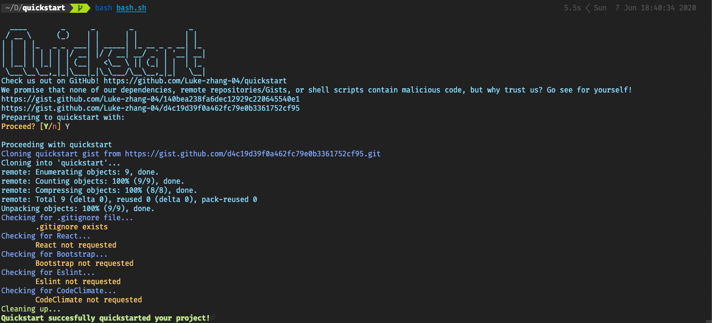

<div align="center">
    <a href="https://github.com/Luke-zhang-04/quickstart"></a>
</div>

One command to quickstart your project.

***

<p align="center">
    <a href="https://github.com/Luke-zhang-04/quickstart/blob/master/LICENSE"></a>
    <a href="https://github.com/Luke-zhang-04/quickstart/releases"></a>
    <a href="https://github.com/Luke-zhang-04/quickstart/actions?query=workflow%3Atests"></a>
    <a href="http://app.codacy.com/manual/luke.zhang2004/quickstart/dashboard"></a>
</p>

Shell scripts to help you configure a project faster.

## Windows
Unfortunately, I have no idea how to use Powershell or command prompt. Any help adding support for Windows would be great. Alternatively, you can try and get some sort of bash/zsh emulator for Windows.

## Resources
We use resources from the following Gists:<br/>
[https://gist.github.com/Luke-zhang-04/140bea238fa6dec12929c220645540e1](https://gist.github.com/Luke-zhang-04/140bea238fa6dec12929c220645540e1)<br/>
[https://gist.github.com/Luke-zhang-04/d4c19d39f0a462fc79e0b3361752cf95](https://gist.github.com/Luke-zhang-04/d4c19d39f0a462fc79e0b3361752cf95)

## Installation
### Curl
```bash
curl -L https://github.com/Luke-zhang-04/quickstart/archive/<VERSION_NAME>.tar.gz | tar zx # Download file
mv quickstart-<VERSION_NAME> quickstart/ # Rename folder to just quickstart
```
### Git Clone
Warning: this clones the latest version from master, which may not be stable
```bash
git clone https://github.com/Luke-zhang-04/quickstart.git quickstart # Clones repo to quickstart dir
```
Alternaitvely, you can download manually from [https://github.com/Luke-zhang-04/quickstart/releases](https://github.com/Luke-zhang-04/quickstart/releases)

## Add to PATH (Optional)
You can add quickstart to your PATH, for an example, in bash or zsh:
```bash
PATH=$PATH:~/path_to_quickstart/quickstart/
```
Or in fish:
```bash
set PATH $PATH:~/path_to_quickstart/quickstart/
```

## Usage
### Example React App, Typescript, Bootstrap, Eslint, Stylelint, CodeClimate, and Make
<details open>
<summary>bash</summary>
<p>

```bash
cd my_project_root
bash ../quckstart/quickstart.bash react ts bs esl sl cc make
```
</p>
</details>
<details>
<summary>zsh</summary>
<p>
Coming soon, for now, just run with bash

```zsh
cd my_project_root
bash ../quckstart/quickstart.bash react ts bs esl sl cc make
```
</p>
</details>
<details>
<summary>fish</summary>
<p>
Coming soon, for now, just run with bash

```shell
cd my_project_root
bash ../quckstart/quickstart.bash react ts bs esl sl cc make
```
</p>
</details>
<details>
<summary>Powershell</summary>
<p>
Coming soon
</p>
</details>

### Quickstart without any options

